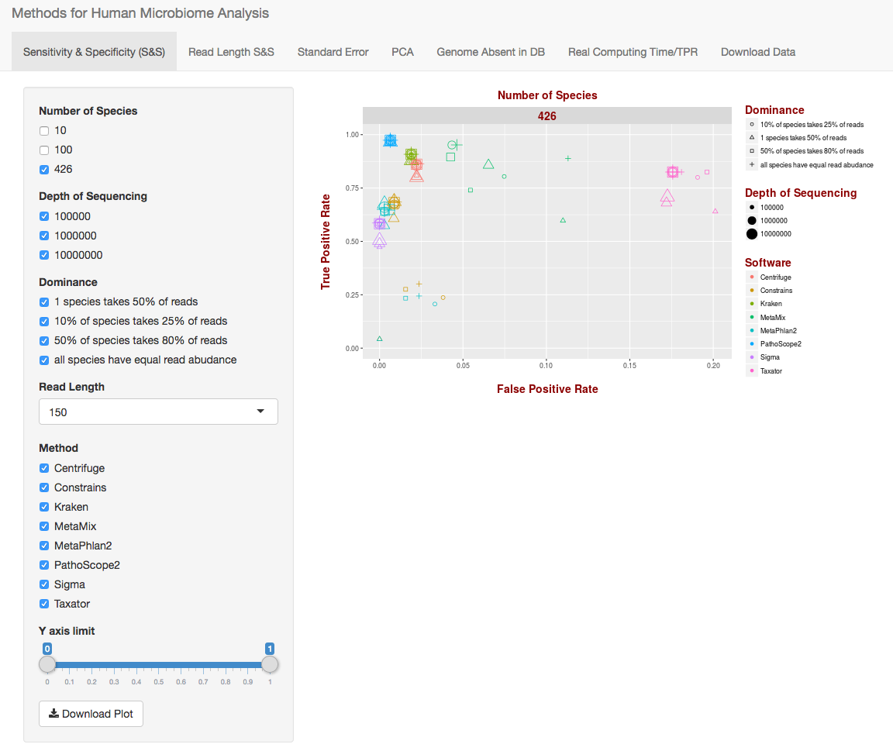

# HumanMicrobiomeAnalysis
R Shiny application for the vizualiation of data presented in the paper <b>Evaluation of Computational Methods for Human Microbiome Analysis Using Simulated Data (not yet published) </b>

To run this graph, simply download the R scripts in this folder as well as data and modules. Make sure R is installed on your machine (https://www.r-project.org/). For a slick R dev interface, we recommend using Rstudio (https://www.rstudio.com/)

Before attempting to run the app, make sure that the following required packages are installed:

- shiny
- shinythemes
- stringr
- ggplot2
- reshape2
- phyloseq
- plyr

The Phyloseq package should be downloaded from bioconductor following the instructions given at: https://bioconductor.org/packages/release/bioc/html/phyloseq.html. All other packages can be downloaded using the R command: install.packages(<i>nameofthepackage</i>)
